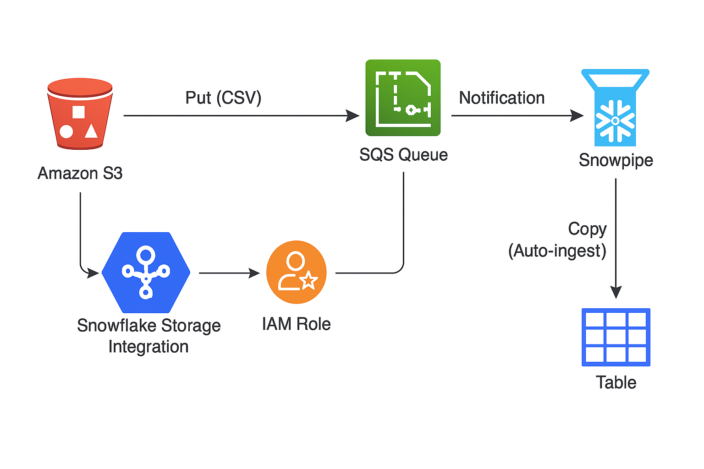

# 🚀 Snowflake × AWS S3 × Snowpipe Terraform Pipeline

---

## 📄 概要

このリポジトリは、AWS S3 にアップロードした CSV ファイルを Snowflake の Snowpipe を使って自動で取り込み、Terraform で IaC 化したものです。

---

## 🎯 背景と目的

Snowflake と AWS S3 の連携を Terraform で完全自動化するのは難易度が高いです。  
IAM ロールの信頼関係設定や Snowflake Storage Integration の外部 ID・通知 ARN など動的な情報を事前に取得し、連携する必要があるためです。

本リポジトリでは、Terraform と AWS CLI、Snowflake SQL を組み合わせて再現性の高い環境構築を実現しています。

---

## 📥 使用データ（Kaggle より取得）

以下の統計データを活用します：

- **NETFLIX の株価**  
  https://www.kaggle.com/datasets/adilshamim8/netflix-stock-price-history

---

## 🗺 アーキテクチャ図



---

## 📂 ディレクトリ構成

.
├── aws
│ ├── backend.tf
│ ├── locals.tf # 変数定義(ARN や External ID など)
│ ├── main.tf
│ ├── modules
│ │ └── s3_snowpipe
│ │ ├── iam.tf
│ │ ├── storage.tf
│ │ └── variables.tf
│ ├── provider.tf
│ ├── setup.txt
│ └── trust-policy.json
├── snowflake
│ ├── locals.tf # Snowflake 側変数
│ ├── main.tf
│ ├── provider.tf
│ ├── terraform.tfstate
│ └── terraform.tfstate.backup
├── setup.sh # セットアップ用スクリプト（IAM ロール作成・import 等）
└── README.md

---

## 🛠 環境構築手順

1. AWS CLI でダミー IAM ロールと S3 バケットを作成

```bash
cd aws

aws iam create-role --role-name SnowflakeRole --assume-role-policy-document file://trust-policy.json

aws s3api create-bucket --bucket karasuit-etl-bucket --region ap-northeast-1 --create-bucket-configuration LocationConstraint=ap-northeast-1
```

2. Terraform にてリソースを import

```bash
terraform import module.s3_snowpipe.aws_iam_role.snowflake_role SnowflakeRole

terraform import module.s3_snowpipe.aws_s3_bucket.etl-bucket karasuit-etl-bucket
```

3. Snowflake 以外の Terraform リソースを apply

cd ../snowflake

```bash
terraform apply -target=snowflake_warehouse.warehouse \
                -target=snowflake_database.netflix_database \
                -target=snowflake_schema.netflix_schema \
                -target=snowflake_table.netflix_table \
                -target=snowflake_storage_integration.s3_int \
                -target=snowflake_stage.s3_stage \
                --auto-approve
```

4. Snowflake Integration から IAM ユーザー ARN と External ID を取得

```bash
snowsql -c karasuit -q "DESC INTEGRATION S3_INT;" | grep STORAGE_AWS_IAM_USER_ARN

snowsql -c karasuit -q "DESC INTEGRATION S3_INT;" | grep STORAGE_AWS_EXTERNAL_ID
```

5. 取得した値を aws/locals.tf にセット
6. IAM ロールの信頼ポリシーを修正し、Terraform で IAM ロールを apply

```bash
terraform apply -target=module.s3_snowpipe.aws_iam_role.snowflake_role --auto-approve
```

7. Snowflake の PIPE を作成

```bash
cd ../snowflake

terraform apply --auto-approve
```

8. PIPE の Notification Channel（SQS ARN）を取得し aws/locals.tf の notification_channel に反映
9. aws フォルダで S3 バケット通知設定を apply

```bash
terraform apply --auto-approve
```

10. S3 にファイルをアップロードし Snowpipe の自動データロードを確認

## ⚠️ 注意点・工夫

- Terraform で一括管理が難しいため段階的に apply して依存関係を解消
- 動的に変わる External ID や Notification Channel は locals.tf で変数管理し、手動またはスクリプトで更新
- IAM ロールの信頼ポリシーは Terraform 作成時に制約があるため AWS CLI で先に作成し import
- 同一ファイル名の再アップロードは Snowpipe が無視するためファイル名のユニーク化を運用ルールとして設定

---

## ⚙️ 自動化のバランスについて

setup.sh による初期の IAM ロール・S3 バケット作成と import は自動化し、  
locals.tf に変動値を手動または簡易スクリプトで反映する運用設計としています。

Terraform ファイルを自動書き換えしてしまうと、設定内容の追跡が困難になるため、  
PIPE 作成や IAM ロール信頼ポリシー修正などはあえて手動 apply とし、安定運用を優先しています。

---

## 🧰 使用技術

- Terraform
- AWS CLI
- Snowflake SQL (Snowpipe 関連)
- Bash スクリプト

---

## 🎉 まとめ

Terraform を中心に Snowflake と AWS のクロスクラウドリソースを管理し、  
Snowpipe によるリアルタイムデータロード環境を構築しました。  
動的情報の管理に工夫が必要でしたが、手順を明確に分離し再現可能な IaC を実現しています。
